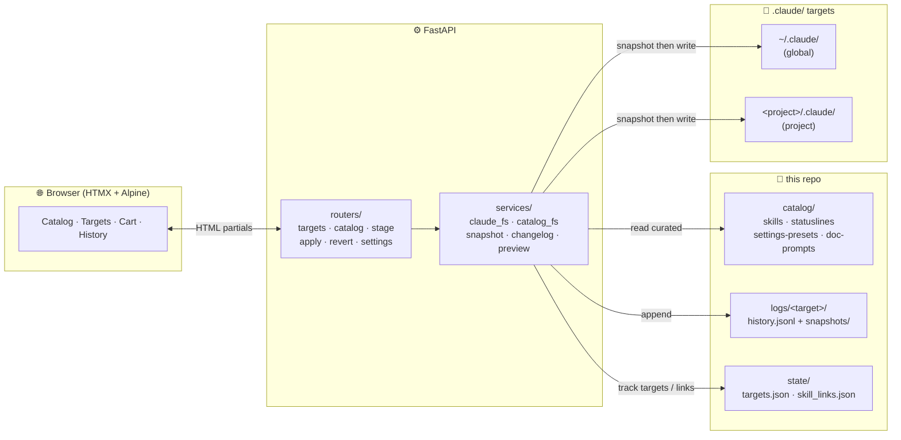

# nekoclaude

Local web UI to manage Claude Code configs across machines. Manages `~/.claude/` (global) and any number of project-local `.claude/` directories from a single browser tab. Every change is staged, diff-previewed, and applied with a snapshot so it can be reverted.

## Quick start

```bash
uv sync
uv run uvicorn app.main:app --reload          # binds 127.0.0.1:8000
```

Or to reach it from other devices on a tailnet / LAN:

```bash
uv run uvicorn app.main:app --host 0.0.0.0 --port 8000 --reload
```

Open the host in a browser.

## How it works



```mermaid
sequenceDiagram
  participant U as User
  participant UI as Browser
  participant API as FastAPI
  participant SVC as services/
  participant T as .claude/ target

  U->>UI: click "Stage install humanizer"
  UI->>API: POST /stage/add
  API-->>UI: updated cart (HTML)

  U->>UI: click "Diff" on cart item
  UI->>API: GET /stage/diff/0
  API->>SVC: preview_op(op, target)
  SVC->>T: read current state
  T-->>SVC: file contents
  SVC-->>API: aligned left/right rows
  API-->>UI: color-coded diff

  U->>UI: click "Apply all"
  UI->>API: POST /apply
  API->>SVC: snapshot touched paths
  SVC->>T: copy current → logs/&lt;t&gt;/snapshots/&lt;cid&gt;/
  API->>SVC: write op (install/patch/etc.)
  SVC->>T: write new files
  API->>SVC: append history.jsonl
  API-->>UI: per-target results
```

## Layout

```
app/
  main.py             FastAPI entrypoint, routers + static
  config.py           Path constants, Target dataclass, slug derivation
  deps.py             Session id + target resolution helpers
  templating.py       Jinja2 instance + pretty_json filter
  routers/            Thin HTTP handlers; no fs writes outside services
  services/           Only layer that touches .claude/ filesystems
    claude_fs.py        read/write skills + settings + statusline on targets
    catalog_fs.py       read/write the repo's catalog/
    apply.py            the snapshot→write→log mutation pipeline
    snapshot.py         selective copy + restore for revert
    changelog.py        per-target append-only JSONL
    stage.py            in-memory cart keyed by session cookie
    preview.py          side-by-side aligned diffs for staged ops
    targets_store.py    state/targets.json persistence + discovery
    skill_links.py      state/skill_links.json bookmark registry
    templates_lib.py    bundled starter library of presets + doc prompts
  templates/          Jinja2 templates (base + partials)
  static/             app.css, app.js

catalog/
  skills/<slug>/        manifest.json + SKILL.md + supporting files
  statuslines/<slug>/   manifest.json + statusline.sh
  settings-presets/<slug>/  manifest.json + settings.partial.json
  doc-prompts/          <KIND>.prompt.md files

logs/<target-slug>/   history.jsonl + snapshots/<change-id>/
state/                targets.json, skill_links.json
```

Project docs live in [`.claude/`](.claude/) (the directory Claude Code auto-loads):

- [`.claude/PROGRESS.md`](.claude/PROGRESS.md) — what's done vs what's pending (30-second scan)
- [`.claude/TODO.md`](.claude/TODO.md) — flat list of next things
- [`.claude/ARCHITECTURE.md`](.claude/ARCHITECTURE.md) — module → responsibility map
- [`.claude/DESIGN.md`](.claude/DESIGN.md) — trade-offs and rejected alternatives
- [`.claude/DECISIONS.md`](.claude/DECISIONS.md) — ADR-style log
- [`.claude/CONSTRAINTS.md`](.claude/CONSTRAINTS.md) — hard rules
- [`.claude/HANDOFF.md`](.claude/HANDOFF.md) — current WIP state for a pickup
- [`.claude/MEMORY.md`](.claude/MEMORY.md) — glossary + don't-repeat-this
- [`.claude/CONVERSATION.md`](.claude/CONVERSATION.md) — operator-intent thread
- [`.claude/EXPERIMENT.md`](.claude/EXPERIMENT.md) — tried / considered / failed
- [`.claude/LOG.md`](.claude/LOG.md) — dated work log
- [`.claude/ERRORS.md`](.claude/ERRORS.md) — known bugs + fixed incidents
- [`.claude/AGENT.md`](.claude/AGENT.md) — operating manual for future Claude sessions
- [`.claude/PLAN.md`](.claude/PLAN.md) — next milestone
- [`.claude/SECURITY.md`](.claude/SECURITY.md) — threat model
- [`.claude/CHANGELOG.md`](.claude/CHANGELOG.md) — chronological changes
